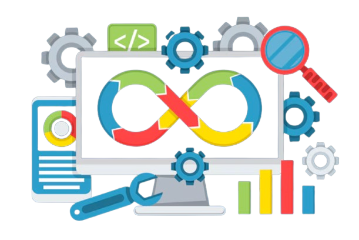

<h1 align="center" style="border-bottom: none">
    <br>
</h1>

<h1 align="center" style="border-bottom: none">
    👋 Seja bem-vindo!<br>
</h1>

---

Você está prestes a iniciar uma jornada que pode transformar sua carreira. O mercado de trabalho atual exige profissionais ```capacitados```, que dominem as ferramentas mais modernas de automação, integração e infraestrutura em nuvem. E mais do que isso: profissionais valorizados e ```altamente remunerados```, capazes de entregar soluções ```ágeis, seguras e escaláveis```.

Neste curso, você será preparado para atuar como um verdadeiro **Engenheiro DevOps** — um perfil cada vez mais procurado pelas empresas, com salários acima da média do setor de tecnologia.

Durante sua formação, você aprenderá a **implementar pipelines**, **automatizar infraestrutura**, **monitorar sistemas** e **entregar aplicações em escala**, utilizando as ferramentas que moldam o ```DevOps moderno```:


  <table border="0">
    <tr>
      <td  style="text-align: right;"></td>
      <td>Provedores de nuvem líderes, essenciais para <br>criar e gerenciar ambientes escaláveis e seguros.</td>
    </tr>
    <tr>
      <td> Sistema operacional base <br>para a maioria dos servidores e containers.</td>
    <td></td>
    </tr>
    <tr>
      <td style="text-align: right;"></td>
      <td>Automatiza a criação e gestão de infraestrutura como código..</td>
    </tr>
    <tr>
      <td>Realizar configurações automáticas<br> e orquestra servidores com eficiência.</td>
    <td></td>
    </tr>
    <tr>
      <td style="text-align: right;"></td>
      <td>Cria ambientes portáteis e reproduzíveis com containers.</td>
    </tr>
    <tr>
      <td>Gerencia e escala aplicações <br>em containers de forma automatizada.</td>
    <td></td>
    </tr>
    <tr>
      <td style="text-align: right;"></td>
      <td>Coletar e armazenar métricas para monitoramento.</td>
    </tr>
    <tr>
      <td>Criar dashboards visuais e interativos para análise de métricas.</td>
    <td></td>
    </tr>
    <tr>
      <td style="text-align: right;"></td>
      <td>Automatizar tarefas do sistema de forma prática e poderosa.</td>
    </tr>
    <tr>
      <td>Linguagem versátil para automação, integração e manipulação de dados.</td>
    <td></td>
    </tr>
    <tr>
      <td style="text-align: right;">
      </td>
      <td>Automatizar o processo de compilação, testes e empacotamento de aplicações</td>
    </tr>
    <tr>
      <td>Criar documentação técnica.</td>
    <td></td>
    </tr>
    <tr>
      <td style="text-align: right;"></td>
      <td>Sistema de controle de versão distribuído que permite registrar, acompanhar e coordenar alterações em arquivos de projetos, especialmente de código-fonte.</td>
    </tr>
    <tr>
      <td>Pipeline CI/CD -  Integrar, testar e entregar aplicações de forma contínua, garantindo agilidade e qualidade no desenvolvimento de software</td>
    <td>
  
  </td>
    </tr>
  </table>


Ao final do curso, você estará preparado para o mercado, com um portfólio completo de projetos reais e domínio técnico das ferramentas mais requisitadas por empresas do Brasil e do mundo.

---

<br><br>
<h4 align="center" style="border-bottom: none">
    <a href="./devops/cultura.md">,🚀 PRESS START 🚀</a>
</h4>
